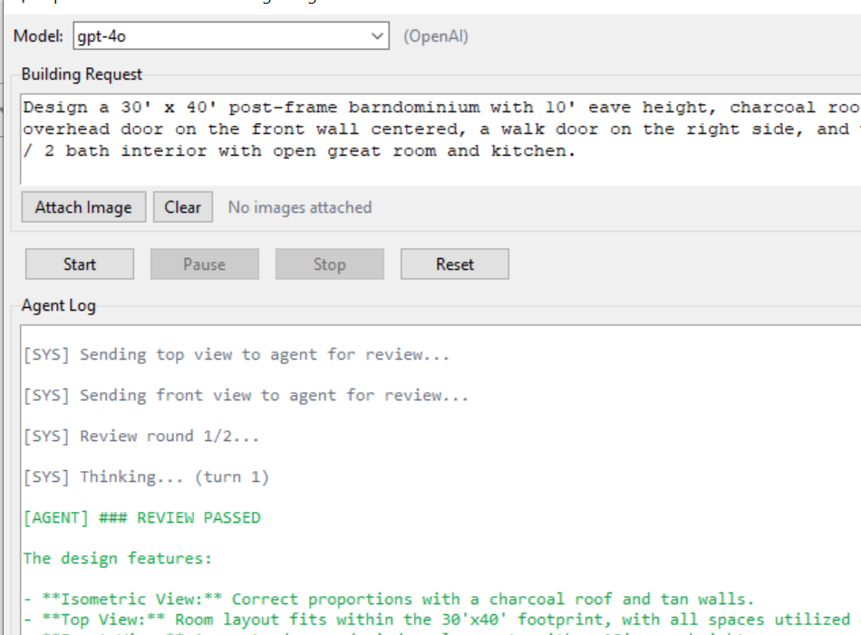
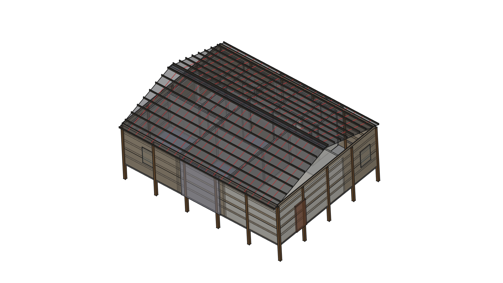
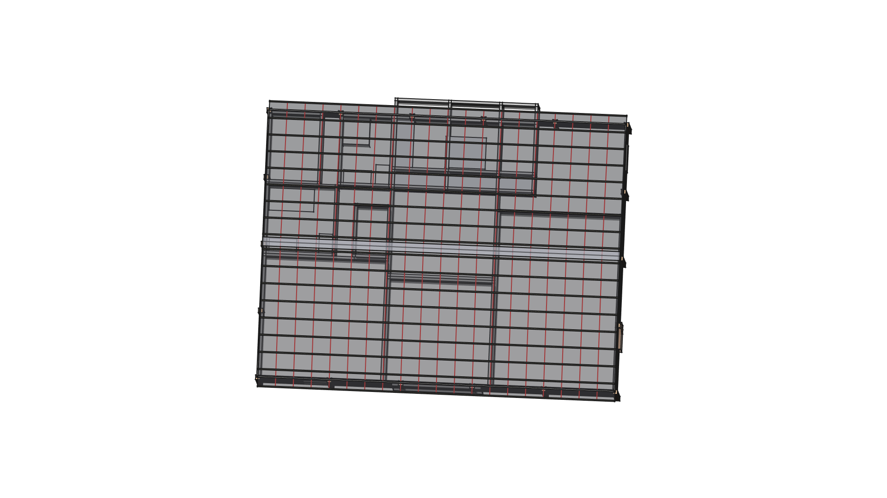

# ClawdCAD - Post Frame Building Designer

An AI agent that generates architectural drawings for rectangular post-frame
(pole barn) buildings in FreeCAD. Describe a building in plain English and the
agent produces the 3D model.



## FreeCAD Output

30' x 80' post-frame barndominium with 3-bed/2-bath interior, charcoal roof, tan wall panels:



Floor plan view showing interior room layout:



## Features

- Natural language building descriptions -> FreeCAD 3D models
- Post-frame construction: posts, girts, trusses, purlins, ridge cap, slab, doors, windows
- Steel rib roof panels and wall panels with color options
- **Algorithmic interior layout engine** with architectural best practices:
  - Zone-based room allocation (public/private/service) with split-bedroom pattern
  - Squarified treemap room packing for optimal aspect ratios
  - Adjacency-aware hill-climbing optimisation (kitchen next to great room, etc.)
  - Plumbing clustering to minimise wet wall runs and drain stack distances
  - Hallway generation with dead-end avoidance and connectivity validation
  - IRC-compliant door sizing (28"/32"/36") with swing clearance collision detection
  - Open-concept support (no wall between great room and kitchen)
- Complete interior buildout: bedrooms, bathrooms, kitchen with island, great room
- Image upload support for floor plan sketches and reference photos
- Self-review cycle: agent captures FreeCAD screenshots and corrects mistakes
- Multi-provider LLM support: Anthropic, DeepSeek, OpenAI, Grok (xAI)
- All dimensions in feet and inches (converts to mm internally for FreeCAD)
- Tkinter GUI with Start / Pause / Stop controls
- Headless CLI mode for scripting

## Project Structure

```
clawdbotCAD/
├── main.py                 # Entry point (GUI or headless)
├── config.py               # Default settings
├── requirements.txt        # Python dependencies
├── OpenClaw.bat            # Windows desktop launcher
├── .env.example            # API key template
├── agent/
│   ├── agent.py            # Multi-provider LLM agent loop
│   ├── prompts.py          # System prompt + tool definitions
│   ├── macro_generator.py  # FreeCAD macro code generator
│   └── layout_engine.py    # Algorithmic floor plan layout engine
├── gui/
│   └── app.py              # Tkinter GUI
├── tools/
│   ├── units.py            # Feet/inches <-> mm conversion
│   └── freecad_tools.py    # FreeCAD tool functions
├── templates/
│   └── post_frame_defaults.json
├── test_build.py           # Structural build tests
├── test_interior.py        # Interior macro generation tests
├── test_layout_engine.py   # Layout engine tests (22 tests)
├── docs/images/            # Screenshots for README
└── output/                 # Generated macros and .FCStd files
```

## Setup

### 1. Python dependencies

```bash
pip install -r requirements.txt
```

### 2. API keys

Copy `.env.example` to `.env` and fill in your keys:
```bash
cp .env.example .env
```

Supported providers (add any or all):
```
ANTHROPIC_API_KEY=your-anthropic-key
DEEPSEEK_API_KEY=your-deepseek-key
OPENAI_API_KEY=your-openai-key
GROK_API_KEY=your-xai-grok-key
```

**Never commit `.env` to version control** — it is listed in `.gitignore`.

### 3. FreeCAD (required for 3D output)

Install FreeCAD 1.0+ from https://www.freecad.org/downloads.php

Without FreeCAD the agent runs in **dry-run mode** - it logs every tool call
and tracks components but does not produce actual 3D geometry.

## Supported Models

| Provider | Cheapest Model | Input $/M | Output $/M |
|----------|---------------|-----------|------------|
| DeepSeek | `deepseek-chat` | $0.28 | $0.42 |
| OpenAI | `gpt-4.1-nano` | $0.10 | $0.40 |
| xAI/Grok | `grok-4-1-fast` | $0.20 | $0.50 |
| Anthropic | `claude-haiku-4-5-20251001` | $1.00 | $5.00 |

## Usage

### GUI mode (default)

```bash
python main.py
```

Or double-click **OpenClaw.bat** (loads `.env` keys automatically).

1. Select a model from the dropdown (supports Anthropic, DeepSeek, OpenAI, Grok)
2. Type a building description in the prompt box
3. Optionally attach a floor plan image for the agent to replicate
4. Click **Start**
5. Watch the agent log as it creates each component
6. Agent auto-launches FreeCAD, reviews its own output, and self-corrects
7. Use **Pause** / **Stop** to control execution

### Headless mode

```bash
python main.py --headless "Design a 30x40 shop with a 12x12 overhead door"
```

### Example prompts

- `Design a 30' x 40' post-frame shop with 10' eave height`
- `Build a 24x36 pole barn with two 10x10 overhead doors on the front`
- `Design a 30x80 barndominium, 3 bed / 2 bath, charcoal roof, tan walls`
- `Design a 40x60 equipment building, 14' eaves, 4:12 pitch, three overhead doors`

## How it works

1. User enters a building description in natural language
2. The LLM interprets the request and calls tools in sequence
3. Each tool generates FreeCAD Python macro code for building components
4. For residential interiors, the `generate_floor_plan` tool invokes the **layout engine**:
   - Parses the room program (bedroom/bathroom count, optional rooms)
   - Allocates zone strips along the building length (split-bedroom pattern)
   - Packs rooms using squarified treemap with zone-specific custom packers
   - Optimises adjacency via hill-climbing swaps
   - Clusters wet rooms to minimise plumbing runs
   - Generates hallways with dead-end avoidance and connectivity checks
   - Places IRC-compliant doors with swing clearance validation
   - Creates interior wall segments with open-concept support
5. The complete macro is written to a `.py` file and FreeCAD auto-launches it
6. FreeCAD captures screenshots (isometric, top, front views)
7. Screenshots are sent back to the agent for self-review
8. If errors are found, the agent corrects and regenerates (up to 2 rounds)
9. The final model is saved as `.FCStd`

## Layout Engine

The layout engine (`agent/layout_engine.py`) generates architecturally-sound
residential floor plans without relying on the LLM for room placement. It
implements research-backed architectural principles:

| Phase | Description |
|-------|-------------|
| 1. Zone allocation | Split-bedroom pattern: master wing, center public/service, secondary wing |
| 2. Room packing | Squarified treemap + custom packers for center zone and bedroom wings |
| 3. Adjacency optimisation | Hill-climbing swaps to satisfy mandatory/prohibited adjacency rules |
| 3b. Plumbing clustering | Minimise Manhattan distance between wet rooms; back-to-back bathroom bonus |
| 4. Hallway generation | Zone-boundary corridors + wing hallways with dead-end avoidance |
| 4b. Connectivity check | BFS flood-fill ensures every room reaches main circulation |
| 5. Door placement | IRC-compliant sizing (28"/32"/36") with 6" corner offset |
| 5b. Swing clearance | Quarter-circle arc collision detection; auto-flip conflicting swings |
| 6. Wall generation | Interior walls with door gaps and open-concept support |

## Running Tests

```bash
python test_layout_engine.py   # 22 layout engine tests
python test_interior.py        # Interior macro generation
python test_build.py           # Structural build
```
